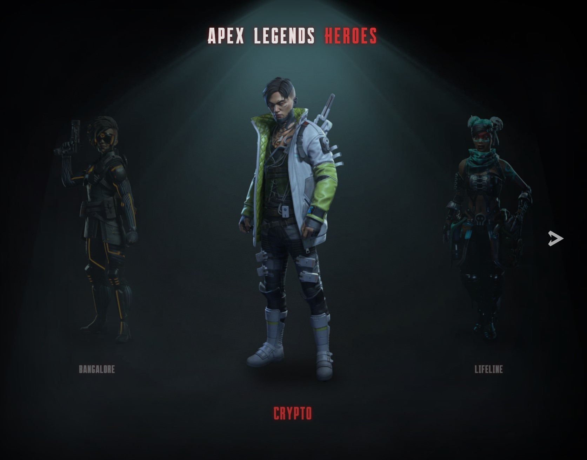
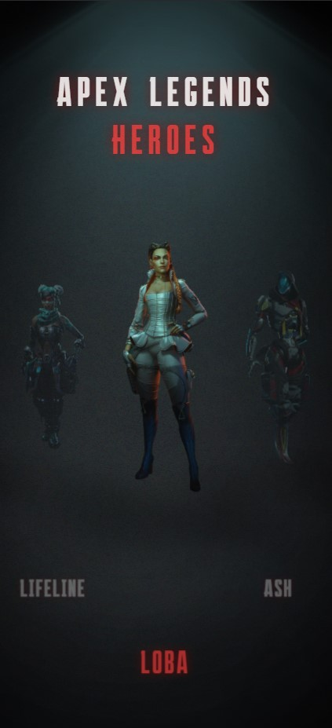

# **_Apex Legends Heroes Showcase Slider Effect Website_**

## About

Awesome website w/ smooth showcase carousel animation effects!
​
> version: Feb 2024, created by Gleb 'Faitsuma' Kiryakov

## Preshow

  <h3 align="left"><u>Large size display mode:</u></h3>
  

   

  <h3 align="left"><u>Small size display mode:</u></h3>
  

## Documentation
* Photoshop guide: https://helpx.adobe.com/photoshop/user-guide.html;
* JS docs: https://developer.mozilla.org/en-US/docs/Web/JavaScript;
* HTML docs: https://developer.mozilla.org/en-US/docs/Web/HTML;
* CSS docs: https://developer.mozilla.org/en-US/docs/Web/CSS;
* SCSS docs: https://sass-lang.com/documentation/;
* SCSS compile hero pro extension: https://marketplace.visualstudio.com/items?itemName=Wscats.eno
* Google Fonts: https://fonts.google.com;
* Git: https://githowto.com/ru;
* Color Picker: https://www.w3schools.com/colors/colors_picker.asp;
* _Cubic-bezier_ animation function: https://cubic-bezier.com/;